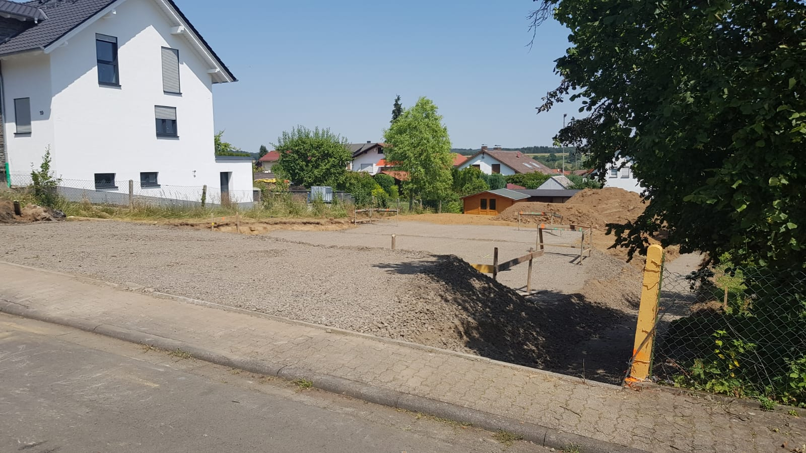

<a href="../assets/img/25_07_2019_(3).jpg" data-lightbox="Schotter" data-title="">.jpg)</a>

<a href="../assets/img/25_07_2019_(4).jpg" data-lightbox="Schotter" data-title="">.jpg)</a>

<a href="../assets/img/25_07_2019_(5).jpg" data-lightbox="Schotter" data-title="">.jpg)</a>

<a href="../assets/img/25_07_2019_(2).jpg" data-lightbox="Schotter" data-title="">.jpg)</a>

[Zurück](/hausblog)  
