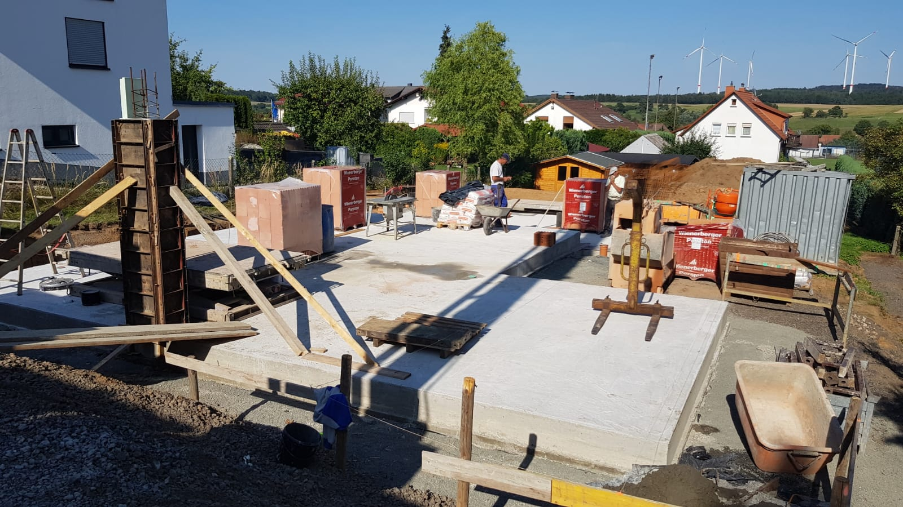

<a href="../assets/img/22_08_2019_(1).jpg" data-lightbox="Mauern" data-title="">.jpg)</a>

<a href="../assets/img/22_08_2019_(2).jpg" data-lightbox="Mauern" data-title="">.jpg)</a>

<a href="../assets/img/22_08_2019_(3).jpg" data-lightbox="Mauern" data-title="">.jpg)</a>

<a href="../assets/img/22_08_2019_(4).jpg" data-lightbox="Mauern" data-title="">.jpg)</a>

<a href="../assets/img/22_08_2019_(5).jpg" data-lightbox="Mauern" data-title="">.jpg)</a>

<a href="../assets/img/22_08_2019_(6).jpg" data-lightbox="Mauern" data-title="">.jpg)</a>

<a href="../assets/img/22_08_2019_(7).jpg" data-lightbox="Mauern" data-title="">.jpg)</a>

<a href="../assets/img/22_08_2019_(8).jpg" data-lightbox="Mauern" data-title="">.jpg)</a>

<a href="../assets/img/22_08_2019_(9).jpg" data-lightbox="Mauern" data-title="">.jpg)</a>

<a href="../assets/img/22_08_2019_(10).jpg" data-lightbox="Mauern" data-title="">.jpg)</a>

<a href="../assets/img/22_08_2019_(11).jpg" data-lightbox="Mauern" data-title="">.jpg)</a>

<a href="../assets/img/22_08_2019_(12).jpg" data-lightbox="Mauern" data-title="">.jpg)</a>

<a href="../assets/img/22_08_2019_(13).jpg" data-lightbox="Mauern" data-title="">.jpg)</a>

<a href="../assets/img/22_08_2019_(14).jpg" data-lightbox="Mauern" data-title="">.jpg)</a>

<a href="../assets/img/22_08_2019_(15).jpg" data-lightbox="Mauern" data-title="">.jpg)</a>

[Zurück](/hausblog)  
