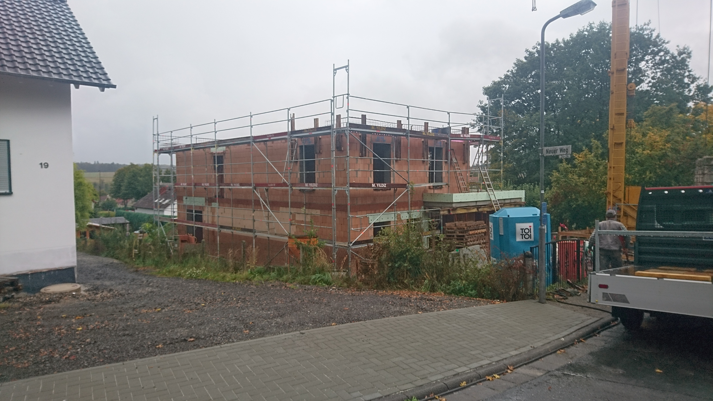

<a href="../assets/img/24_09_2019_(1).jpg" data-lightbox="deckeOG" data-title="">.jpg)</a>

<a href="../assets/img/24_09_2019_(2).jpg" data-lightbox="deckeOG" data-title="">.jpg)</a>

<a href="../assets/img/24_09_2019_(3).jpg" data-lightbox="deckeOG" data-title="">.jpg)</a>

<a href="../assets/img/24_09_2019_(4).jpg" data-lightbox="deckeOG" data-title="">.jpg)</a>

<a href="../assets/img/24_09_2019_(5).jpg" data-lightbox="deckeOG" data-title="">.jpg)</a>

 

***  

 

September 29th, 2019 by hautaklyttn

<a href="../assets/img/29_09_2019_(1).jpg" data-lightbox="deckeOG" data-title="">.jpg)</a>

<a href="../assets/img/29_09_2019_(2).jpg" data-lightbox="deckeOG" data-title="">.jpg)</a>

<a href="../assets/img/29_09_2019_(3).jpg" data-lightbox="deckeOG" data-title="">.jpg)</a>

<a href="../assets/img/29_09_2019_(4).jpg" data-lightbox="deckeOG" data-title="">.jpg)</a>

<a href="../assets/img/29_09_2019_(5).jpg" data-lightbox="deckeOG" data-title="">.jpg)</a>

<a href="../assets/img/29_09_2019_(6).jpg" data-lightbox="deckeOG" data-title="">.jpg)</a>

<a href="../assets/img/29_09_2019_(7).jpg" data-lightbox="deckeOG" data-title="">.jpg)</a>

[Zurück](/hausblog)  
