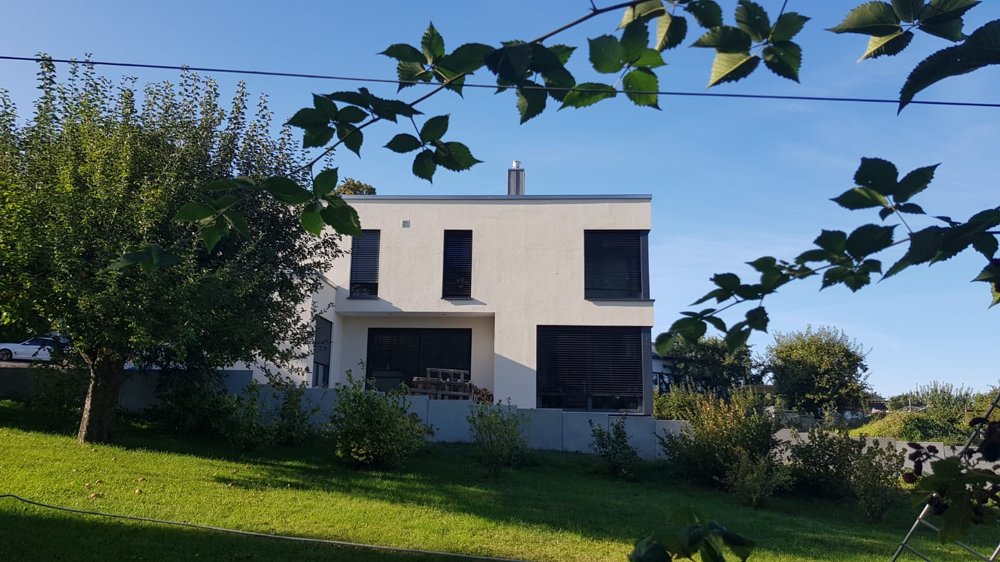

<a href="../assets/img/24_08_2020_(1).jpg" data-lightbox="aFi" data-title="">.jpg)</a>

<a href="../assets/img/24_08_2020_(2).jpg" data-lightbox="aFi" data-title="">.jpg)</a>

<a href="../assets/img/24_08_2020_(3).jpg" data-lightbox="aFi" data-title="">.jpg)</a>

<a href="../assets/img/24_08_2020_(4).jpg" data-lightbox="aFi" data-title="">.jpg)</a>

<a href="../assets/img/24_08_2020_(5).jpg" data-lightbox="aFi" data-title="">.jpg)</a>

<a href="../assets/img/24_08_2020_(6).jpg" data-lightbox="aFi" data-title="">.jpg)</a>

<a href="../assets/img/24_08_2020_(7).jpg" data-lightbox="aFi" data-title="">.jpg)</a>

<a href="../assets/img/24_08_2020_(8).jpg" data-lightbox="aFi" data-title="">.jpg)</a>

<a href="../assets/img/24_08_2020_(9).jpg" data-lightbox="aFi" data-title="">.jpg)</a>

[Zurück](/hausblog)  
